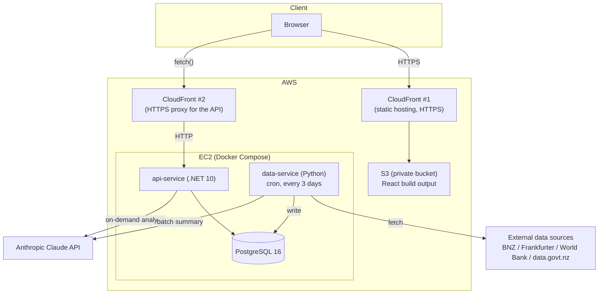
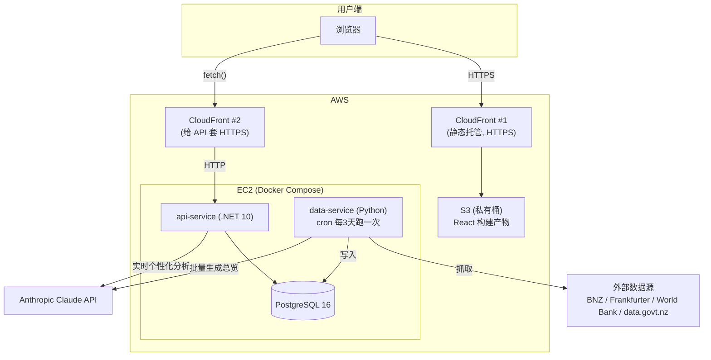

# NZ Market Insights

A full-stack economic & housing market dashboard for New Zealand — live data collection, statistical analysis, and on-demand AI-generated insights, built end to end (Python → PostgreSQL → C# API → React) and deployed on AWS.

**Live site:** [nz-market-insights.colinl.xyz](https://nz-market-insights.colinl.xyz)

---

## Overview

NZ Market Insights answers a practical question — *is now a good time to buy a house in New Zealand, and what's happening with rates, inflation, and the exchange rate?* — by pulling real data from public NZ sources, computing the numbers that actually matter (real vs. nominal price growth, price-cost ratios, deposit/mortgage/rent affordability, term-deposit vs. home-loan spread), and presenting it as a dashboard with an optional AI-generated narrative on top.

It's a solo project built to go deep on a Python/C#/React/AWS stack end to end rather than wide across many small exercises — every layer, from scraping and schema design through the API and frontend to the deployment pipeline, reflects a specific design decision, not a framework default left in place.

## Architecture



Two separate CloudFront distributions front the two origins: one serves the static React build from a fully private S3 bucket (Origin Access Control, no public bucket access), the other proxies the EC2 API over HTTPS so the browser never has to make a mixed-content HTTP request to a plain EC2 IP. Full write-up of *why* (including the mixed-content bug and the fix) is in [DEPLOYMENT.md](DEPLOYMENT.md).

## Tech Stack

| Layer | Technology | Notes |
|---|---|---|
| Data collection | Python 3.13, `requests`, `pandas`, `SQLAlchemy` | Scrapes/calls 4 external sources, transforms, loads to Postgres |
| Statistical analysis | `pandas`, `scipy`, `statsmodels`, Jupyter | Correlation, regression, multivariate OLS — see `data-service/notebooks/deep_analysis.ipynb` |
| Backend API | C# / ASP.NET Core, .NET 10, EF Core (Npgsql) | 8 REST controllers, typed DTOs, dependency-injected services |
| AI | Anthropic Claude (`claude-haiku-4-5`) | Batch narrative summary (Python) + real-time personalized analysis (C#, official Anthropic .NET SDK) |
| Frontend | React 19, TypeScript, Vite 8, ECharts, `react-router-dom` | Two pages: default dashboard + interactive filter/AI-query page |
| Database | PostgreSQL 16 | 7 tables; append-only history for rate data, native-history tables for housing/economic data |
| Infra | Docker Compose, AWS (EC2, S3, CloudFront, ACM), Cloudflare DNS | Same `docker-compose.yml` runs identically in dev and production |
| CI/CD | GitHub Actions | 3 parallel test jobs on every push/PR; gated manual deploy job |

## Key Features

- **Default dashboard** — key economic indicators, BNZ term-deposit/home-loan rates, NZD exchange rates, housing affordability and sale price by city (current snapshot + multi-year trend), all in one page.
- **"Is now a good time to buy?"** market-insights panel — real vs. nominal price trend, price-cost ratio vs. its own 20-year average, drawdown from the all-time high, year-over-year volatility, a capital-allocation comparison (property vs. term deposit vs. idle cash, all inflation-adjusted), regional price comparison, and how much of the year-to-year affordability swing is explained by unemployment.
- **AI Analysis page** — pick which datasets to include (with real per-source filters: year/date range, city, term, indicator — all populated from what's actually in the database, not free-text guessing), write a custom question, and get a live Claude-generated analysis grounded in the selected data.
- **Self-healing data pipeline** — each of the 5 data sources is fetched and loaded independently; if one third-party API times out or errors, the others still update instead of the whole nightly refresh silently failing.

## Data Sources

| Source | What | How |
|---|---|---|
| BNZ (bank.co.nz) | Term deposit rates, home loan rates | Official site is JS-rendered — reverse-engineered the underlying JSON/XML endpoints via browser dev tools instead of scraping HTML |
| Frankfurter API | NZD exchange rates (USD/EUR/CNY/AUD/GBP/JPY/SGD) | Public REST API |
| World Bank API | Inflation, GDP growth, unemployment rate | Public REST API |
| data.govt.nz (HUD / Urban Development dataset) | Housing affordability index, sale price & floor area by city | CSV downloads |

## Testing

24 tests across three languages, run automatically in CI on every push/PR:

- **C# (xUnit, 9 tests)** — unit tests for the `GroupBy`/dedupe query logic in `BankRateService`/`FxRatesService`/`LoanRateService` against an EF Core in-memory database; integration tests that spin up a real in-memory `WebApplicationFactory` and hit `GET /api/BankRates` and `POST /api/Analysis` end to end, with a `FakeClaudeService` swapped in via dependency inversion so tests never call the paid AI API.
- **Python (pytest, 10 tests)** — the pure parsing functions (`parse_prices`, `parse_loan_rates`, `parse_csv`, `na_to_none`), including edge cases like missing fields and empty data.
- **Frontend (Vitest, 5 tests)** — the only non-declarative logic in the frontend, `formatDate`/`formatNumber`.

Details on what's covered and why in [TESTING.md](TESTING.md).

## Getting Started

```bash
git clone https://github.com/Colin-L123/nz-market-insights.git
cd nz-market-insights
cp .env.example .env   # fill in POSTGRES_* and ANTHROPIC_API_KEY
docker compose up -d
```

- API: `http://localhost:8080/api/...`
- Frontend dev server (hot reload): `cd web-client && npm install && npm run dev` → `http://localhost:5173`
- Refresh data manually: `docker compose run --rm data-service python src/load_data.py`

## Deployment

Runs on a single EC2 instance (Docker Compose: `db` + `data-service` + `api-service`), with the React build served separately from a private S3 bucket behind CloudFront, a second CloudFront distribution proxying the API over HTTPS, and a cron job refreshing data every 3 days. Full architecture, every design decision, and every bug hit along the way (Docker healthcheck races, mixed-content errors, S3 upload path gotchas, CORS vs. mixed-content being two separate browser checks) are written up in [DEPLOYMENT.md](DEPLOYMENT.md).

## Project Structure

```
nz-market-insights/
├── data-service/     # Python: fetch, transform, load, analyze
│   ├── src/
│   ├── tests/
│   └── notebooks/deep_analysis.ipynb
├── api-service/      # C#/.NET: REST API + AI analysis endpoint
│   └── Controllers/  # BankRates, LoanRates, FxRates, EconomicIndicators,
│                      # HousingAffordability, HousingSalePrice, MarketInsights, Analysis
├── ApiService.Tests/
├── web-client/        # React + TypeScript + ECharts
│   └── src/pages/     # HomePage, AnalysisPage
├── db/schema.sql
└── docker-compose.yml # identical definition for local dev and production
```

## Engineering Notes

A few decisions worth knowing the reasoning behind:

- **Append vs. snapshot tables** — `bank_rates`/`fx_rates`/`loan_rates` are append-only (a `fetched_at` timestamp distinguishes runs), so rate history accumulates over time instead of each refresh overwriting the last. `housing_*`/`economic_indicators` already carry their own year/date column from the source data, so they're replaced wholesale each run.
- **Dependency inversion for testability** — `AnalysisController` depends on `IClaudeService`, not the concrete `ClaudeService`, purely so tests can swap in a `FakeClaudeService` and verify the request/response flow without spending money on a real API call.
- **Data quality bugs caught by cross-checking, not assumed away** — the housing affordability index direction was initially interpreted backwards (verified and fixed against the official [data.govt.nz](https://catalogue.data.govt.nz/dataset/d9585bff-7f6a-49c5-8fb0-5a6ce23e32c7) documentation), and "Auckland" was silently duplicated on several city-comparison charts because the housing datasets report the same area name at two different geography levels (TA vs. EUA/Region) — area name alone isn't a unique key, `areaType` has to be part of the filter too.
- **Per-source error isolation in the data pipeline** — the nightly refresh script originally ran all five fetchers sequentially with no error handling, so one flaky third-party API timing out silently skipped every source after it in the list. Each source now runs independently and logs its own failure instead of taking the rest down with it.

## License

MIT

---

# NZ Market Insights（中文说明）

一个覆盖新西兰经济与房产市场的全栈数据看板——实时抓取数据、做统计分析、按需生成 AI 洞察，技术栈全链路（Python → PostgreSQL → C# API → React）从数据到部署全部打通，上线在 AWS 上。

**线上地址：** [nz-market-insights.colinl.xyz](https://nz-market-insights.colinl.xyz)

---

## 项目概览

这个项目要回答一个很实际的问题——*现在是不是在新西兰买房的好时机？利率、通胀、汇率现在都是什么情况？*——做法是从新西兰的公开数据源抓真实数据，算出真正有意义的指标（剔除通胀后的真实房价涨幅、房价成本比、首付/房贷/租金三个维度的可负担性、定存和房贷的利差），做成一个看板，上面再叠加一层可选的 AI 生成的文字解读。

这是一个人独立完成的学习型项目，目标是把 Python/C#/React/AWS 这套技术栈**从头到尾走深**，而不是做很多零散的小练习——每一层（爬取、ETL、关系型数据库设计、类型化的 REST API、React 前端、容器化部署）背后都有具体的设计取舍和理由，不是随手套用默认模板。

## 系统架构



两个独立的 CloudFront 分别代理两个源站：一个把 React 构建产物从完全私有的 S3 桶（通过 Origin Access Control）分发出来；另一个把 EC2 上的 API 套一层 HTTPS 转发出去，让浏览器不用直接对着裸 HTTP 的 EC2 地址发请求（否则会被浏览器的 Mixed Content 安全策略直接拦截）。完整的原理和踩坑记录见 [DEPLOYMENT.md](DEPLOYMENT.md)。

## 技术栈

| 层 | 技术 | 说明 |
|---|---|---|
| 数据采集 | Python 3.13、`requests`、`pandas`、`SQLAlchemy` | 抓取/调用 4 个外部数据源，清洗后写入 Postgres |
| 统计分析 | `pandas`、`scipy`、`statsmodels`、Jupyter | 相关性、回归、多元回归分析，见 `data-service/notebooks/deep_analysis.ipynb` |
| 后端 API | C# / ASP.NET Core、.NET 10、EF Core (Npgsql) | 8 个 REST 接口，类型化 DTO，依赖注入的 Service 层 |
| AI | Anthropic Claude（`claude-haiku-4-5`） | 批量生成的总览文字（Python）+ 实时个性化分析（C#，官方 .NET SDK） |
| 前端 | React 19、TypeScript、Vite 8、ECharts、`react-router-dom` | 两个页面：默认展示看板 + 可交互筛选/AI 提问页 |
| 数据库 | PostgreSQL 16 | 7 张表；利率类数据追加式存历史，房价/经济指标类数据自带历史字段 |
| 基础设施 | Docker Compose、AWS（EC2/S3/CloudFront/ACM）、Cloudflare DNS | 本地开发和线上生产用的是同一份 `docker-compose.yml` |
| CI/CD | GitHub Actions | 每次 push/PR 自动并行跑三边测试；部署 job 需手动触发且有前置条件 |

## 主要功能

- **默认展示看板**——关键经济指标、BNZ 定存/房贷利率、纽币汇率、分城市的房价可负担性和成交价（当前快照 + 多年趋势），一个页面全部看到。
- **"现在是不是买房好时机"分析面板**——真实（剔除通胀）vs 名义房价趋势、当前房价成本比相对自身20年均值的位置、距历史最高点的回撤幅度、年度波动率、资金配置对比（房产 vs 定存 vs 闲置现金，均为真实收益）、区域房价对比，以及可负担性的年度波动有多少能被失业率解释。
- **AI 分析页**——自己勾选要用哪些数据集（每个都有真正基于数据库实际范围的筛选条件：年份/日期区间、城市、期限、指标——不是瞎猜的自由输入），写一个自定义问题，实时拿到基于所选数据生成的 Claude 分析结果。
- **有自愈能力的数据管道**——5 个数据源各自独立抓取、独立写入，某一个第三方接口超时或报错，其他几个照常更新，不会因为一个源出问题导致整晚的定时刷新静默全部失败。

## 数据来源

| 来源 | 内容 | 方式 |
|---|---|---|
| BNZ（bank.co.nz） | 定期存款利率、房贷利率 | 官网是 JS 渲染的，靠浏览器开发者工具找到背后真实的 JSON/XML 接口直接调用，不解析 HTML |
| Frankfurter API | 纽币兑各国汇率（USD/EUR/CNY/AUD/GBP/JPY/SGD） | 公开 REST API |
| World Bank API | 通胀率、GDP 增速、失业率 | 公开 REST API |
| data.govt.nz（HUD / Urban Development 数据集） | 房价可负担性指数、分城市成交价与建筑面积 | CSV 下载 |

## 测试

三种语言共 24 个测试，每次 push/PR 都会在 CI 里自动跑：

- **C#（xUnit，9个）**——针对 `BankRateService`/`FxRatesService`/`LoanRateService` 里 `GroupBy` 去重查询逻辑的单元测试（用 EF Core 内存数据库）；以及真正起一个内存版 `WebApplicationFactory`、完整发 HTTP 请求测 `GET /api/BankRates` 和 `POST /api/Analysis` 的集成测试，其中 AI 服务通过依赖倒置换成了 `FakeClaudeService`，测试不会真的调用付费 API。
- **Python（pytest，10个）**——纯解析函数（`parse_prices`、`parse_loan_rates`、`parse_csv`、`na_to_none`），覆盖正常输入和边界情况（缺字段、空数据）。
- **前端（Vitest，5个）**——前端代码里唯一有真逻辑的部分，`formatDate`/`formatNumber`。

具体测了什么、为什么这么测，见 [TESTING.md](TESTING.md)。

## 本地运行

```bash
git clone https://github.com/Colin-L123/nz-market-insights.git
cd nz-market-insights
cp .env.example .env   # 填入 POSTGRES_* 和 ANTHROPIC_API_KEY
docker compose up -d
```

- API：`http://localhost:8080/api/...`
- 前端开发服务器（热更新）：`cd web-client && npm install && npm run dev` → `http://localhost:5173`
- 手动刷新数据：`docker compose run --rm data-service python src/load_data.py`

## 部署

跑在一台 EC2 实例上（Docker Compose 管理 `db`/`data-service`/`api-service` 三个容器），React 构建产物单独放在私有 S3 桶后面接 CloudFront 分发，另有一个 CloudFront 专门给 API 套 HTTPS，cron 每 3 天自动刷新一次数据。完整架构、每一个设计决策、路上踩过的每个坑（Docker 健康检查的启动顺序竞态、Mixed Content 报错、S3 上传路径的坑、CORS 和 Mixed Content 是两道独立的浏览器安全检查）全部记在 [DEPLOYMENT.md](DEPLOYMENT.md) 里。

## 项目结构

```
nz-market-insights/
├── data-service/     # Python：抓取、转换、入库、分析
│   ├── src/
│   ├── tests/
│   └── notebooks/deep_analysis.ipynb
├── api-service/      # C#/.NET：REST API + AI 分析接口
│   └── Controllers/  # BankRates、LoanRates、FxRates、EconomicIndicators、
│                      # HousingAffordability、HousingSalePrice、MarketInsights、Analysis
├── ApiService.Tests/
├── web-client/        # React + TypeScript + ECharts
│   └── src/pages/     # HomePage、AnalysisPage
├── db/schema.sql
└── docker-compose.yml # 本地开发和线上生产用的是同一份定义
```

## 工程笔记

几个值得说明"为什么这么做"的决策：

- **追加式表 vs 快照式表**——`bank_rates`/`fx_rates`/`loan_rates` 是追加式的（靠 `fetched_at` 时间戳区分每次抓取），历史数据会随时间积累，而不是每次刷新就覆盖上一次的结果；`housing_*`/`economic_indicators` 因为数据源本身就自带年份/日期字段，所以是每次整体替换。
- **依赖倒置换来的可测试性**——`AnalysisController` 依赖的是 `IClaudeService` 这个接口，不是具体的 `ClaudeService` 类，唯一目的就是让测试能换成 `FakeClaudeService`，验证请求/响应流程走得通，而不用真的花钱调 AI API。
- **靠交叉核实抓出来的数据质量问题，不是想当然放过**——房屋可负担性指数一开始方向理解反了（对照 [data.govt.nz 官方说明](https://catalogue.data.govt.nz/dataset/d9585bff-7f6a-49c5-8fb0-5a6ce23e32c7) 核实后改正）；好几张城市对比图里"Auckland"曾经被静默地重复显示两次，原因是房屋数据集里同一个地名在两种不同地理统计口径下（TA 行政区 vs EUA/大区）各存了一条记录——光靠地名不是唯一键，筛选时必须把 `areaType` 也带上。
- **数据管道的单源故障隔离**——夜间刷新脚本原来是五个抓取函数顺序执行、没有任何错误处理，只要有一个第三方接口偶尔超时，排在它后面的所有数据源都会被静默跳过。现在每个数据源独立运行、失败了只打印自己的错误，不会连累其他几个。

## 许可

MIT
